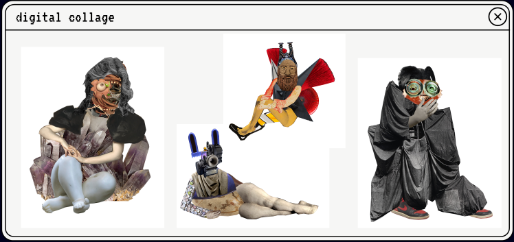

# Scientist
<figure class="third">
	
	
	
</figure>
Disclaimer: Because I am a scientist, organiser and performing artists, it is difficult to show examples of my work while preserving my anonimity. My body and my person are an integral part of what I do. Nevertheless I made an attempt to remove references that would immediately lead to my name, but many of the videos include me introducing myself, and it is up to the comission whether they should view them or not. 		

My academic work focuses on Natural Language Processing, and specifically on multilingual systems. For the preservation of the anonimity of this applications I can only provide links to my papers upon request.

In addition to providing a safe place to socialise at conferences and advocating for queer researchers in AI, [Queer in AI](https://sites.google.com/view/queer-in-ai/home) has released a guide on how to make conferences more inclusive for queer people. I have been a co-author and you can read it [here](https://sites.google.com/view/queer-in-ai/diversity-guide?authuser=0).
		
I feel very passionate about open source software and I think research code should be available to the public. You can find the code that goes along with my publications on github. To preserve the anonimity of this application, I will provide the link upon request. 

# Organiser
<figure class="third">
	
	
	
</figure>

I was [NAACL 2021](https://2021.naacl.org/) Social Chair. My responsibilities:
- Enabling financial access to the conference as part of the D&I team, [see here](https://www.youtube.com/watch?v=SDBS8DFVENY)
- Organizing social events and supporting grass-root organizations in conducting their socials. One example was the Mexican culture series [here](https://2021.naacl.org/blog/mexican-event/), and events with affinity groups [here](https://2021.naacl.org/blog/affinity-groups/)
- Hosting a diversity and inclusion panel discussion: [here](https://www.youtube.com/watch?v=mCVY4mRqNok&t=236s)
I was also host to three Queer in AI conference socials at [EACL 2021](https://sites.google.com/view/queer-in-ai/eacl-2021?authuser=0), [Coling 2020](https://sites.google.com/view/queer-in-ai//coling-2020) and [EMNLP 2020](https://sites.google.com/view/queer-in-ai//emnlp2020)

I hosted Informatics Open Art Space, a weekly in-person art making event at the University of Edinburgh, connecting researchers, PhD students and administrative staff and offering art forms such as painting, sculpting, lino print and collage. We also had a badge making machine and embroidery kits to produce wearable art. During the pandemic we continued the event virtually. 

You can see talks I’ve held about different topics like my work with Queer in AI, diversity and inclusion efforts and the Informatics Open Art Space [here](https://www.youtube.com/watch?v=Wrgrk-dLNVo) and [here](https://www.meetup.com/dair-ai/events/279070622/)

# Artist
<figure class="third">
	
	
	
</figure>

I make digital collages, lino prints and textiles. You can see some examples of each of these art forms below. My visual art has been published in [the Inkwell](https://issuu.com/publishedinburgh/docs/liminality).

I performed at the Stand Comedy Club in Edinburgh, doing a 7-minute set on AI, alongside many other AI practitioners and comedians. You can see a video of it [here](https://vimeo.com/684162111).

I am writing about my research for a lay audience on [my blog]. To preserve the anonimity of this application, I will provide the link upon request. I also write creative non-fiction, examples of which you can find [here](https://drive.google.com/drive/folders/1c9aomoTxQI-OmB6usZMHTV6HjLzsupIH). My writing has been published by [butchisnotadirtyword magazine](https://butchisnotadirtyword.com/).

